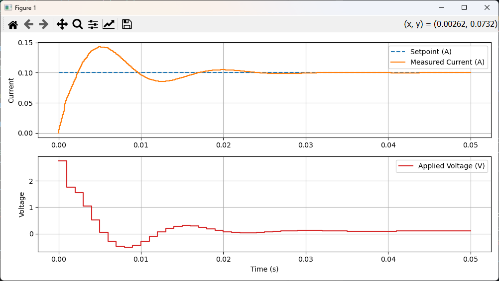

# PID Controller with RL Circuit Simulation (C + Python)

Welcome! This project demonstrates how to use a **PID controller written in C** to control an RL (Resistor–Inductor) circuit, with all simulation and visualization handled in **Python**.  

> **Note:** The included demo uses a **PI controller** (derivative gain= 0), which is a simplified version of PID and commonly used in industry.

---

## Folder Structure

- `source/`  
  Core C code for the PID controller (`pid.c`, `pid.h`).

- `simulation/utils/`  
  Python utility modules for simulation, including plant models, simulators, tuners, and plotting tools.

- `simulation/demo/`  
  Example scripts and ready-to-run demos for simulating and visualizing the RL circuit with the PI controller.

- `simulation/tests/`  
  Unit and integration tests running in a Github CI.

- `docs/`  
  Documentation and tutorials, including a detailed PID theory and tuning guide.

---

## How It Works

- **PID Controller:**  
  Written in C for embedded compatibility. The C code is compiled into a shared library (`.dll` for Windows, `.so` for Linux).  
  The demo uses only the **P** and **I** terms (PI controller).

- **Simulation:**  
  All simulation logic, plant modeling, and visualization are handled in Python. The Python code calls the C PI controller via a wrapper (`pid_wrapper.py`).

---

## Example Output

Below is a typical result from running the demo.  
The PI controller regulates the current in the RL circuit to reach the setpoint:

- **Top:** Current response (orange) tracks the setpoint (blue dashed).
- **Bottom:** Voltage applied by the controller.

---

## Getting Started (VS Code)

1. Open the project folder in **Visual Studio Code**.
2. Run the demo script to see the simulation and plots.
3. **Optional**: Rebuild the PID .dll
 - If you have safety or security concerns, you can delete the existing .dll and generate your own.
 - If you modify the .c/.h, you must generate the .dll.

### DLL Generation
The PID controller is written in C and compiled into a windows DLL (pid.dll) for python to use. The build is definied in **tasks.json**

1. Press ctrl+shift+B (or go to Terminal->RunTask->Build PID Dll)
2. The DLL will be generated in simulation/utils/pid.dll

## Learn More

Want to understand **how PID works** and how to tune it?

[Read the full PID tutorial](docs/PID_TUTORIAL.md)

---

## 📄 License

MIT License